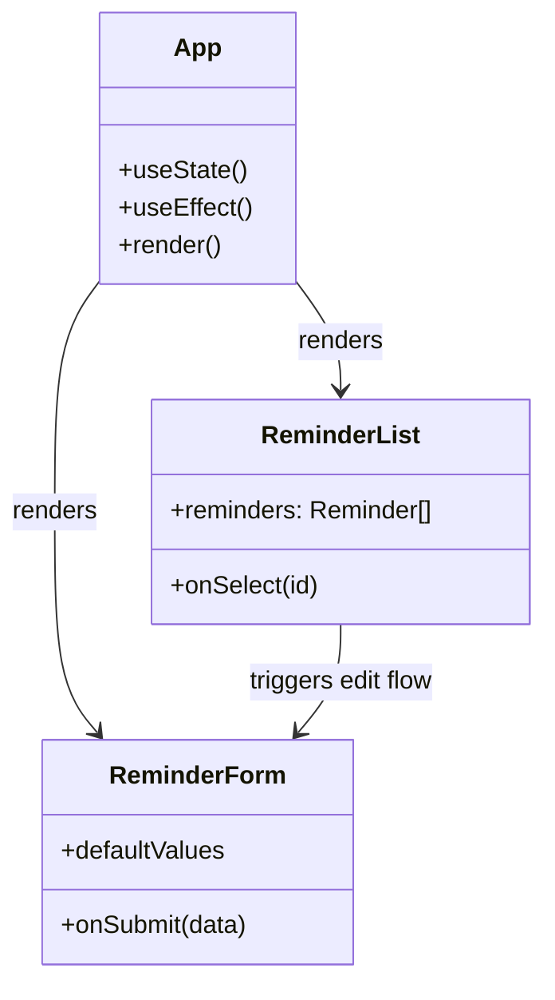

```mermaid 

classDiagram
    direction TB
    class App {
        +useState()
        +useEffect()
        +render()
    }

    class ReminderList {
        +reminders: Reminder[]
        +onSelect(id)
    }

    class ReminderForm {
        +defaultValues
        +onSubmit(data)
    }

    App --> ReminderList : renders
    App --> ReminderForm : renders
    ReminderList --> ReminderForm : triggers edit flow

```